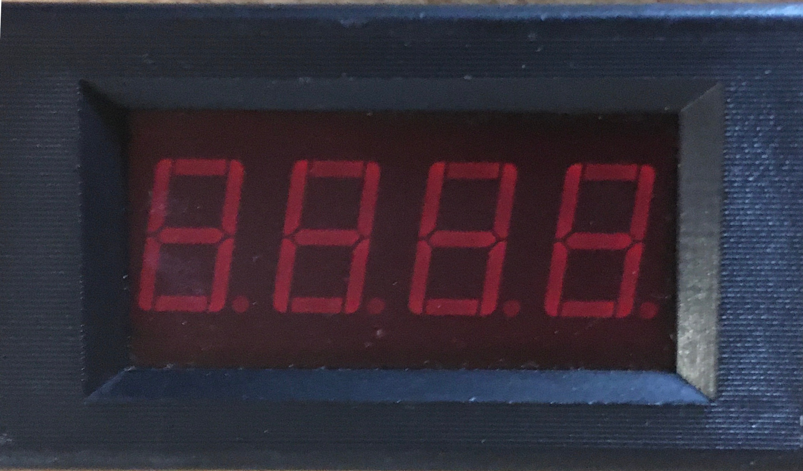
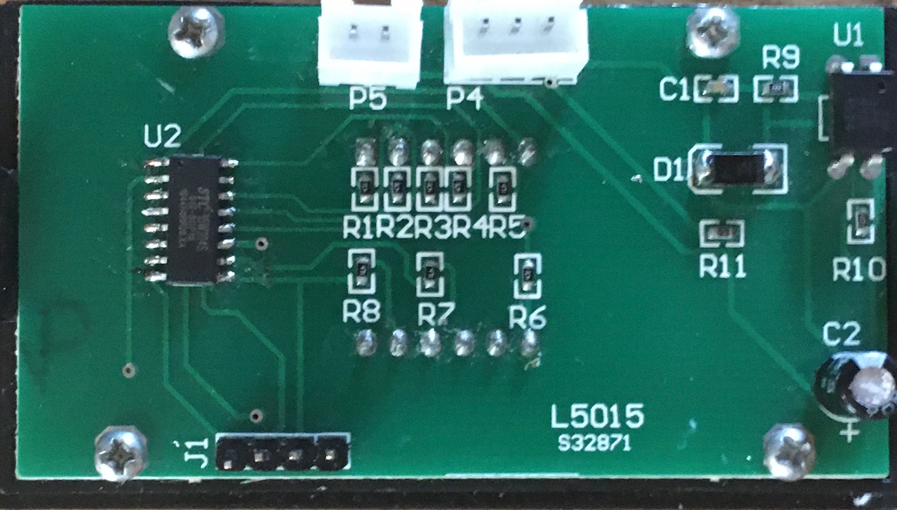

# Tachometer

Lathe/Milling Machine Tachometer

##4 Digit 7 Segment Display for Tachometer using the STmicro 15W204 microcontroller

This microcontroller is very easy to program using just an FTDI serial adapter board with the stc-isp-15xx tool downloaded from http://www.stcmcudata.com.

